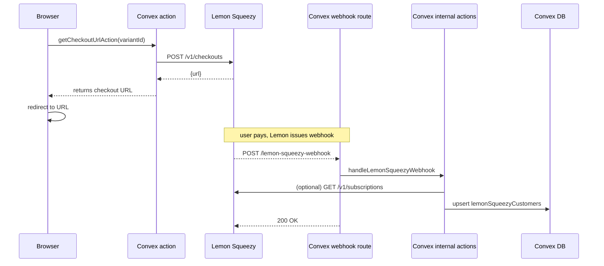

# Lemon Squeezy Payments Overview

> **Status:** draft – generated by AI code review.  Please proof-read & adapt to your own SaaS.

---

## Why Lemon Squeezy?

- Handles EU VAT & invoices out of the box.
- Friendly UI for subscription management.
- Modern JS SDK.

This starter-kit keeps the Lemon Squeezy integration fully isolated so you can swap it out or delete the folder without touching unrelated code.

---

## Folder structure

```text
convex/
└─ lemonSqueezy/
   ├─ subscriptions.ts          ← Webhook verification & DB sync
   ├─ subscriptions_actions.ts  ← Checkout / cancel actions (called from React)
   └─ README.md                 ← (you are here)
```

• `subscriptions.ts` contains **backend logic** only – verifying the HMAC signature, filtering events, up-/down-syncing the Convex `lemonSqueezyCustomers` table.

• `subscriptions_actions.ts` are thin **client-callable actions** (Convex `action()`); they call the Lemon Squeezy SDK to create a checkout session or cancel a subscription.

Keeping "actions" separate from server-only logic makes it obvious which functions are callable from the browser.

---

## High-level flow



### 1.  Checkout

`getCheckoutUrlAction` performs three steps:

1. Auth check – throws if the user is not signed in.
2. Verifies the user is **not already on the same plan**.
3. Calls `createCheckout()` from the Lemon Squeezy SDK.  We pass `user_id` & `variant_id` via `checkoutData.custom` – they are sent back inside the webhook so we can map the payment to a Convex user **without hitting the database**.

### 2.  Webhook

1. `convex/http.ts` exposes a public `POST /lemon-squeezy-webhook` route.
2. We verify the `X-Signature` header using an **HMAC-SHA256** of the raw payload (see `verifyWebhookSignature`).
3. Only subscription-related events are processed – others are ignored early.
4. We try to update the customer from the **webhook payload itself** (fast-path).  If payload is incomplete we **fallback** to the Lemon Squeezy REST API to fetch full customer & subscription objects.

### 3.  Database schema

```ts
const lemonSqueezyCustomers = defineTable({
  userId: v.id("users"),
  customerId: v.number(),
  status: v.string(),           // active, cancelled, etc.
  subscriptionId: v.optional(v.string()),
  variantId: v.optional(v.number()),
  currentPeriodStart: v.optional(v.string()),
  currentPeriodEnd: v.optional(v.string()),
  cancelAtPeriodEnd: v.optional(v.boolean()),
  paymentMethod: v.optional(v.object({
    brand: v.string(),
    last4: v.string(),
  })),
}).index("by_userId", ["userId"]).index("by_customerId", ["customerId"]);
```

The record is **always** updated via `updateLemonSqueezyCustomerData` – a single internal action so we never forget to keep all fields in sync.

---

## Environment variables

| Key | Purpose |
| --- | ------- |
| `LEMONSQUEEZY_API_KEY` | Secret API key for the SDK & REST calls |
| `LEMONSQUEEZY_STORE_ID` | Your Lemon Squeezy store numeric ID |
| `LEMONSQUEEZY_WEBHOOK_SECRET` | Shared secret for the HMAC signature |
| `NEXT_PUBLIC_LEMONSQUEEZY_*_VARIANT` | Public variant IDs used on the pricing page |

The helper `src/config/lemonsqueezy.ts` ensures all required vars are set **before** hitting the API.

---

## Adding a new plan

1. Create a new variant in Lemon Squeezy admin.
2. Add the numeric `variantId` to `const tierMap` inside `subscriptions.ts`.
3. Expose it on the frontend (pricing page) and in `.env.example` as `NEXT_PUBLIC_LEMONSQUEEZY_<PLAN>_VARIANT`.

---

## Common gotchas

- Webhook requests **must** be sent raw – do **not** use `JSON.parse` before verifying the signature.
- Always check `webhookData.meta.event_name`; we ignore events we don’t care about.
- Make sure the webhook endpoint is **HTTPS** in production or the HMAC verification will fail.

---

## TODO / ideas

- Implement `cancelSubscriptionAction` by calling `PATCH /v1/subscriptions/{id}`.
- Move variant → plan mapping to a JSON config so marketing can edit without code changes.
- Add end-to-end Cypress test that creates a test-mode checkout and waits for the webhook.

---

_Questions?  ping @your-username_ 